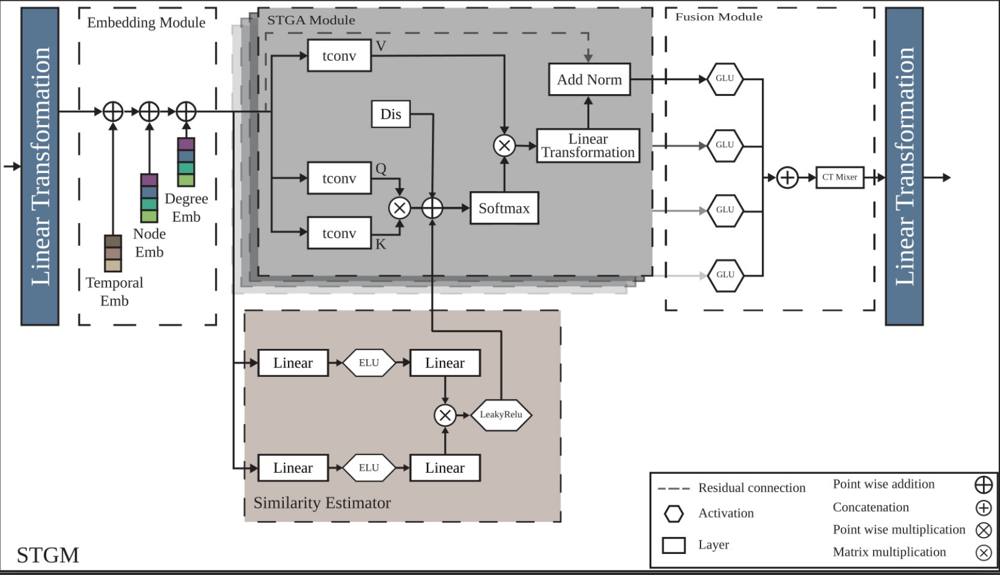
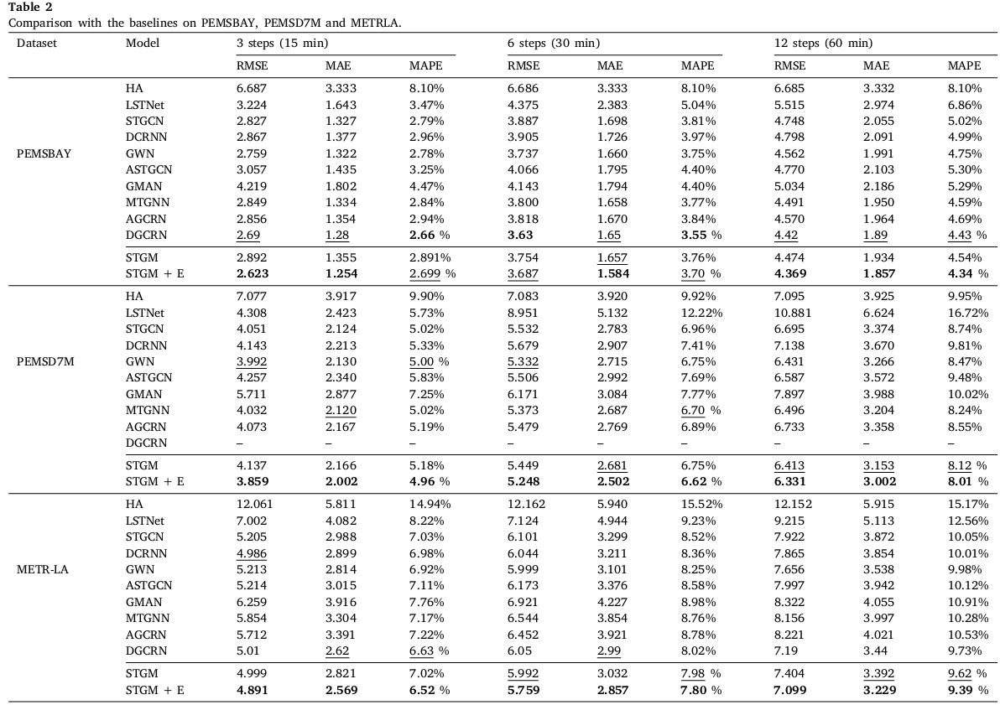
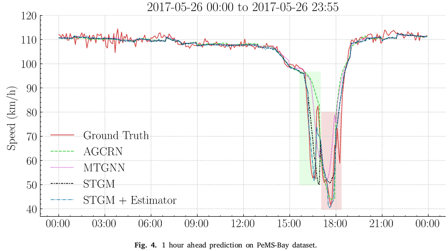
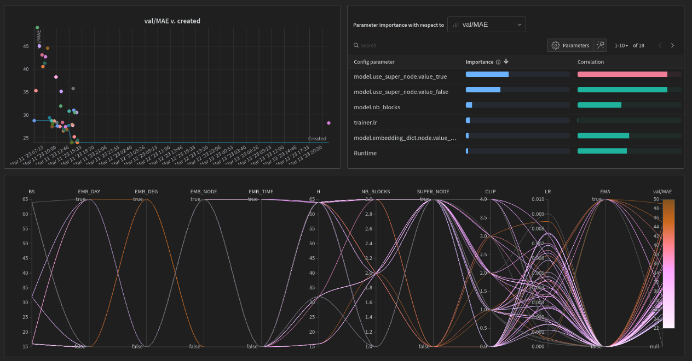

# <div align="center"> STGM: Spatio-Temporal Graph Mixformer for Traffic Forecasting </div>

<p align="center"></p>

<p align="center">
    <a href="https://github.com/Mouradost/STGM/blob/main/LICENSE">
        
    </a>
    <a href="https://zenodo.org/badge/latestdoi/551265354">
        
    </a>
    <a href="https://paperswithcode.com/sota/traffic-prediction-on-metr-la?p=spatio-temporal-graph-mixformer-for-traffic">
        
    </a>
    <a href="https://paperswithcode.com/sota/traffic-prediction-on-pemsd7-m?p=spatio-temporal-graph-mixformer-for-traffic">
        
    </a>
    <a href="https://paperswithcode.com/sota/traffic-prediction-on-pems-bay?p=spatio-temporal-graph-mixformer-for-traffic">
        
    </a>
  <a href="https://github.com/psf/black">
    
  </a>
  <p align="center">
    This is the original repository for the paper entitled "<a href="https://doi.org/10.1016/j.eswa.2023.120281"> Spatio-Temporal Graph Mixformer for Traffic Forecasting </a>".
  </p>
</p>

---

> ## <span id="abstract"> Abstract </span>
>
> Traffic forecasting is of great importance for intelligent transportation systems (ITS). Because of the intricacy implied in traffic behavior and the non-Euclidean nature of traffic data, it is challenging to give an accurate traffic prediction. Despite that previous studies considered the relationship between different nodes, the majority have relied on a static representation and failed to capture the dynamic node interactions over time. Additionally, prior studies employed RNN-based models to capture the temporal dependency. While RNNs are a popular choice for forecasting problems, they tend to be memory hungry and slow to train. Furthermore, recent studies start utilizing similarity algorithms to better express the implication of a node over the other. However, to our knowledge, none have explored the contribution of node $𝑖$’s past, over the future state of node $𝑗$. In this paper, we propose a Spatio-Temporal Graph Mixformer (STGM) network, a highly optimized model with low memory footprint. We address the aforementioned limits by utilizing a novel attention mechanism to capture the correlation between temporal and spatial dependencies. Specifically, we use convolution layers with a variable field of view for each head to capture long–short term temporal dependency. Additionally, we train an estimator model that express the contribution of a node over the desired prediction. The estimation is fed alongside a distance matrix to the attention mechanism. Meanwhile, we use a gated mechanism and a mixer layer to further select and incorporate the different perspectives. Extensive experiments show that the proposed model enjoys a performance gain compared to the baselines while maintaining the lowest parameter counts.

---

## Performance and Visualization





## <span id="table_of_contents"> Table of Contents </span>

```text
datasets
  ├─pemsbay
  |   ├─distances.csv
  |   ├─speed.h5
  ├─metrla
  |   ├─distances.csv
  |   ├─speed.h5
  ├─pemsd7m
  |   ├─distances.csv
  |   ├─speed.csv
src
  ├─configs
  |   ├─datasets
  |   |   ├─pemsbay.yaml
  |   |   ├─metrla.yaml
  |   |   ├─pemsd7m.yaml
  |   ├─estimator
  |   |   ├─default.yaml
  |   ├─model
  |   |   ├─stgm.yaml
  |   |   ├─stgm_full.yaml
  |   ├─trainer
  |   |   ├─default.yaml
  |   |   ├─full.yaml
  |   ├─sweeps
  |   |   ├─pemsbay.yaml
  |   |   ├─metrla.yaml
  |   ├─paths
  |   |   ├─default.yaml
  |   ├─log
  |   |   ├─default.yaml
  |   ├─hydra
  |   |   ├─default.yaml
  |   ├─config.yaml
  ├─helpers
  |   ├─__init__.py
  |   ├─dtw.py
  |   ├─metrics.py
  |   ├─utils.py
  |   ├─viz.py
  ├─datasets
  |   ├─__init__.py
  |   ├─base.py
  |   ├─pems.py
  |   ├─metrla.py
  |   ├─pemsd7m.py
  ├─models
  |   ├─__init__.py
  |   ├─base.py
  |   ├─estimator.py
  |   ├─stgm.py
  |   ├─stgm_full.py
  ├─trainers
  |   ├─__init__.py
  |   ├─base.py
  |   ├─default.py
  |   ├─estimator.py
  |   ├─full.py
  ├─logs                                     -> Run logs
  |   ├─METR-LA                              -> Dataset name (auto-generated)
  |       ├─<DATE>                           -> Starting date (auto-generated)
  |           ├─<TIME>                       -> Starting time (auto-generated)
  |               ├─<MODEL_NAME>             -> Model name (auto-generated)
  |                   ├─config.yaml          -> Config use for this run (auto-generated)
  |                   ├─run.log              -> Run logs (auto-generated)
  |                   ├─model_weights.pt     -> Latest model weights (auto-generated)
  |                   ├─model_weights_*.pt   -> Model weights for a specific checkpoint (auto-generated)
  |                   ├─performance.txt      -> Prediction metrics overview (auto-generated)
  |                   ├─train_history.pdf    -> Train history figure (auto-generated)
  ├─run.py
  ├─inference.py
  ├─__init__.py
.gitignore
LICENSE
README.md
requirements.txt
```

## Requirements

The code is built based on Python 3.11.0, PyTorch 2.0.0 and Hydra 1.3.1.

You can install PyTorch following the instruction on [PyTorch website](https://pytorch.org/get-started/locally/). For example:

```shell
pip install torch==2.0.0+cu117 torchvision==2.0.0+cu117 -f https://download.pytorch.org/whl/torch_stable.html
```

After ensuring that PyTorch is installed correctly, the user can clone the repo and install the remaining dependencies as follows:

```shell
git clone https://github.com/Mouradost/STGM.git
cd ./STGM
pip install -r requirements.txt
```

## <span id="run"> Run STGM (or your custom version) </span>

Our implementation uses the following frameworks for logging and configuration:

- [hydra](https://hydra.cc/) for a configurable and customizable training pipeline, you can find all the options for each module in the folder `src/configs`, refer to [hydra docs](https://hydra.cc/docs/intro/) for further instructions.
- [wandb](https://wandb.ai/site) as an online logger and [logging](https://docs.python.org/3/library/logging.html) as a local logger, in order to choose a logger you need to specify it as an argument to the `run.py` script as follows:
  `shell ./run.py log.type=[wandb | default] `
  We also provide a `BaseClass` for each of `Trainer`, `Model` and `Dataset` that can be extended to customize your run relative to your needs, please refer to [Customize your run](#customization).

The following sections assume the user is situated at `src/`.

```shell
cd [PATH_TO_STGM_REPO_LOCAL_FOLDER]/src/
```

The similarity matrices can be pre-calculated in advance for faster training using the snippet below:

```shell
./helpers/dtw.py [PATH_DATA_FOLDER]
```

For more options try:

```shell
./helpers/dtw.py --help
```

### <span id="train"> Train STGM </span>

Start the run by simply executing `./run.py` or `python run.py` which will use the default configuration. Any parameter to alter the default configuration can be provided following the bellow schema.

```shell
./run.py [MODULE]=$value [MODULE].[PARAM]=$value [TOP_LEVEL_PARAM]=$value
```

Refer to this example if it is ambiguous.

```shell
./run.py trainer.epochs=100 trainer.batch_size=128 dataset=metrla device=cuda:1 model.nb_blocks=1 model=stgm log.type=wandb
```

### <span id="predict"> Predict using STGM </span>

Perform a prediction using the script `./inference.py --path=[PATH_TO_SAVED_FOLDER]` or `python run.py --path=[PATH_TO_SAVED_FOLDER]` which will use the configuration provided in the **PATH_TO_SAVED_FOLDER**.

You can find all available options using `./inference.py --help` or `python run.py --help`.

The folder should follow the following schema:

```text
<SAVED_FOLDER>            -> Any folder that contain the model weights and the configuation file
   ├─config.yaml          -> Config file
   ├─model_weights.pt     -> Model weights
```

### <span id="customization"> Customize your run </span>

#### <span id="custom_dataset"> Dataset </span>

Training and inference can be performed on any dataset that contain the following files:

- A signal file (any time-series data) $X \in \mathcal{R}^{N \times F}$
- A time-steps for each signal entry $T \in \mathcal{R}$
- An adjacency matrix $A \in \mathcal{R}^{N \times N}$

The user only needs to overwrite the `load_data` function in order to provide `self.data`, `self.time_index`, `self.timestamps`, `self.adj`, `self.data_min`, `self.data_max`, `self.data_mean`, and `self.data_std`.

The script for the custom dataset needs to be placed in the _dataset folder_ as follows `./src/datasets/../[DATASET_NAME].py`.

Follow the bellow snippet to provide the necessary data to the `BaseDataset`:

```python
import pandas as pd
from datasets.base import BaseDataset # Base dataset class


class Dataset(BaseDataset):
    # The data_folder_path is provided by the BaseDataset.
    # BaseDataset reads the path from ./src/config/paths/[defaults | user defined config].yaml
    def load_data(self):
        # Loading the adjacency matrix
        self.adj = pd.read_csv(
            self.data_folder_path / "PEMSBAY" / "W_pemsbay.csv"
        ).values # [NB_NODES, NB_NODES]
        # Loading the signal data
        data = pd.read_hdf(self.data_folder_path / "PEMSBAY" / "pems-bay.h5")
        self.data = data.values # [NB_SAMPLES, NB_NODES]
        # Meta-data used for normalization
        self.data_mean, self.data_std = self.data.mean(), self.data.std()
        self.data_min, self.data_max = self.data.min(), self.data.max()
        # Timesteps inferrence
        self.timestamps = data.index # Pandas datetime used for visualization
        self.timestamps.freq = self.timestamps.inferred_freq
        self.time_index = self.time_to_idx(self.timestamps, freq="5min") # IDX representing time of the day and days of the week [NB_SAMPLES, 2]
```

The user need to provide a **YAML** config file for the custom dataset in `./src/config/dataset/`. Refer to [PEMS-BAY Config file](./src/config/dataset/pemsbay.yaml) for all the options.

#### <span id="custom_model"> Model </span>

Follow the bellow snippet to create a custom model, please subclass the `BaseModel` otherwise the program won't run properly since it provides model saving mechanisms and other functionality used in other classes:

```python
import logging
import torch
from models.base import BaseModel


class Model(BaseModel):
    def __init__(
        self,
        in_channels: int = 1,
        h_channels: int = 64,
        out_channels: int = 1,
        device: str = "cpu",
        name: str = "STGM",
        log_level=logging.WARNING,
        *args, # Used to obmit any extra args provided by the run.py or inference.py
        **kwargs # Used to obmit any extra kwargs provided  by the run.py or inference.py
    ):
        super().__init__(name=name, log_level=log_level)
        self.channels_last = channels_last

        # Model definition

    def forward(
        self,
        x: torch.Tensor,  # [B, L, N, F] | [B, F, N, L]
        adj: torch.Tensor,  # [N, N]
        idx: torch.Tensor = None,  # [B, 2, L]
        *args, # Used to obmit any extra args provided by the trainer
        **kwargs # Used to obmit any extra kwargs provided by the trainer
    ) -> torch.Tensor:
        # Permutation if necessairy
        if self.channels_last:
            x = x.transpose(1, -1).contiguous()  # [B, L, N, F] -> [B, F, N, L]
            self.logger.debug("transpose -> x: %s", x.shape)

        # Model logic

        # Permutation if necessairy
        if self.channels_last:
            x = x.transpose(1, -1).contiguous()  # [B, F', N, L] -> [B, L, N, F']
            self.logger.debug("transpose -> x: %s", x.shape)
        return x  # [B, F', N, L] | [B, L, N, F']
```

The user need to provide a **YAML** config file for the custom model in `./src/config/model/`. Refer to [STGM Config file](./src/config/model/stgm.yaml) for all the options. The use can extend the provided model config for any additional parameters to the model.

#### <span id="custom_trainer"> Trainer </span>

The user only needs to overwrite `train`, `train_step`, `validate`, and `val_step` from `BaseTrainer` to create a custom training logic.

Follow the bellow snippet for an easy start 😉.

> Note that there is no need for normalization since it is handled by the `BaseTrainer`.

```python
import torch
from tqdm import tqdm
from tqdm.contrib.logging import logging_redirect_tqdm
from trainers.base import BaseTrainer


class Trainer(BaseTrainer):
    def val_step(
      self,
      x: torch.Tensor,
      y: torch.Tensor,
      idx: torch.Tensor,
      adj: torch.Tensor,
      sim: torch.Tensor
    ) -> float:
      # Compute the loss.
      with torch.autocast(
          device_type="cuda", dtype=torch.float16, enabled=self.use_amp
      ):
          loss = self.loss(x=x, y=y, idx=idx, adj=adj, sim=sim)
      return loss.item()

    @torch.no_grad()
    def validate(self, val_data: torch.utils.data.DataLoader):
        for i, (idx, adj, sim, x, y) in enumerate(val_data):
            idx, adj, sim, x, y = (
                idx.to(self.device), # [B, 2, L]
                adj.to(self.device), # [B, N, N]
                sim.to(self.device), # [B, N, N]
                x.to(self.device),   # [B, L, N, F]
                y.to(self.device)    # [B, L, N, F']
            )
            # Validation step
            self.metrics["val/loss"] += self.val_step(
                x=x, y=y, idx=idx, adj=adj, sim=sim
            ) / (i + 1)

    def train_step(
      self,
      x: torch.Tensor,
      y: torch.Tensor,
      idx: torch.Tensor,
      adj: torch.Tensor,
      sim: torch.Tensor
    ) -> float:
        # Compute the loss.
        with torch.autocast(
            device_type="cuda", dtype=torch.float16, enabled=self.use_amp
        ):
            loss = self.loss(x=x, y=y, idx=idx, adj=adj, sim=sim)
        # Before the backward pass, zero all of the network gradients
        self.opt.zero_grad(set_to_none=True)
        # Backward pass: compute gradient of the loss with respect to parameters
        self.grad_sclaer.scale(loss).backward()
        self.grad_sclaer.step(self.opt)
        self.grad_sclaer.update()
        return loss.item()


    def train(
        self,
        train_data: torch.utils.data.DataLoader,
        val_data: torch.utils.data.DataLoader | None = None,
    ) -> dict:
        self.model.train()
        epoch_loop = tqdm(
            range(self.epochs),
            desc=f"Epoch 0/{self.epochs} train",
            leave=True,
            disable=not self.verbose,
        )
        with logging_redirect_tqdm():
            for epoch in epoch_loop:
                self.metrics["train/loss"] = 0
                self.metrics["val/loss"] = 0
                for i, (idx, adj, sim, x, y) in enumerate(train_data):
                    idx, adj, sim, x, y = (
                        idx.to(self.device), # [B, 2, L]
                        adj.to(self.device), # [B, N, N]
                        sim.to(self.device), # [B, N, N]
                        x.to(self.device),   # [B, L, N, F]
                        y.to(self.device)    # [B, L, N, F']
                    )
                # Train step
                self.metrics["train/loss"] += self.train_step(
                    x=x, y=y, idx=idx, adj=adj, sim=sim
                ) / (i + 1)
                # Validation
                if val_data is not None:
                    self.model.eval()
                    self.validate(val_data=val_data)
                    self.model.train()
                # Log metrics
                self.log(epoch=epoch + 1)
                epoch_loop.set_postfix(
                    loss=self.metrics["train/loss"],
                    loss_val=self.metrics["val/loss"],
                )
                epoch_loop.set_description_str(f"Epoch {epoch + 1}/{self.epochs} train")
        return self.history
```

The user need to provide a **YAML** config file for the custom trainer in `./src/config/trainer/`. Refer to [Trainer Config file](./src/config/trainer/default.yaml) for all the options.

### <span id="sweeps">Hyperparameters search </span>

We also provide an integration of [hydra](https://hydra.cc/) combined with [wandb](https://wandb.ai/) parameter search also called **sweeps**. For more information and tutorials the user can check the following links:

- [Hydra docs](https://hydra.cc/docs/1.1/plugins/optuna_sweeper/)
- [Wandb docs](https://docs.wandb.ai/tutorials/sweeps)
- [Wandb sweeps tutorials](https://docs.wandb.ai/tutorials/sweeps)
- [Wandb + Hydra sweeps article](https://wandb.ai/adrishd/hydra-example/reports/Configuring-W-B-Projects-with-Hydra--VmlldzoxNTA2MzQw)

Some sweep samples are provided under `./src/config/sweeps/*.yaml`, the user can provide its own set of rules and expect similar output as shown below:

> Note: The sweep shown below is an example for a simple model, the user needs to provide a sweep configuration adapted to the size of the model and the dataset for good results.



The user can run the sweeps as follows:

```shell
wandb sweep ./src/config/sweeps/[SWEEP_CONFIG_NAME].yaml
```

Or

```shell
./sweeps.py ./src/config/sweeps/[SWEEP_CONFIG_NAME].yaml
```

Or

```shell
python sweeps.py ./src/config/sweeps/[SWEEP_CONFIG_NAME].yaml
```

## <span id="disclaimer"> Disclaimer </span>

The code in this repo is a simplified and polished version of the original code used for the paper, if you encounter any bugs or a big difference between the metrics reported in the [paper](https://doi.org/10.1016/j.eswa.2023.120281) and your run please open an issue following the provided guidelines.

The base configurations provided in this repo are not the one used in the paper, rather a scaled down version meant to be used on a personal computer as a starting point and a proof of work, refer to the [paper](https://doi.org/10.1016/j.eswa.2023.120281) for the full version which we used to train our model on a server.

## <span id="citing"> Citing STGM </span>

If you find this repository useful for your work, please consider citing it using the following BibTeX entry:

```bibtex
@article{lablack2023spatio,
  title={Spatio-temporal graph mixformer for traffic forecasting},
  author={Lablack, Mourad and Shen, Yanming},
  journal={Expert Systems with Applications},
  volume={228},
  pages={120281},
  year={2023},
  publisher={Elsevier}
}
```
